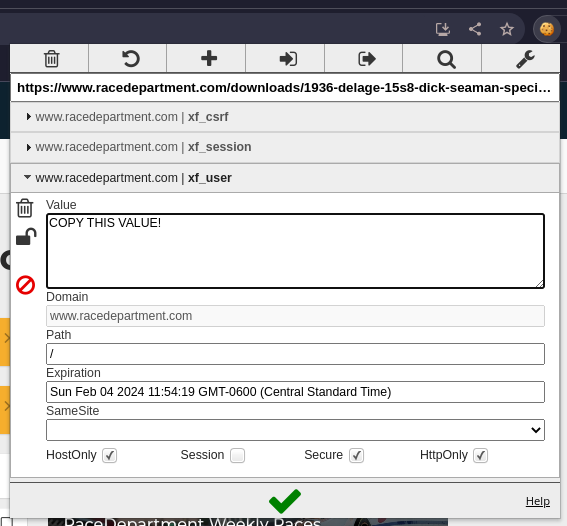

# Assetto Corsa downloader

#### Download cars and tracks from racedepartment.com

## Why?
To avoid visiting the site to figure out what's new and then download it.

## Instalation

### Binary file:

Download from the releases tab:

### Source:

```shell
git clone https://github.com/reneManqueros/assetto-corsa-downloader.git
cd assetto-corsa-downloader/src
go build -ldflags "-w -s" .
```

## Running

### Generate session on racedepartment

1) Log in to the website with your credentials
2) Retrieve cookie info for the downloader:

Use an extension like "EditThisCookie" and extract the value of these 3 cookies:
* xf_csrf
* xf_session
* xf_user



Place them on the config.json file:

```json
{
  "cookie_csrf": "CSRF VALUE HERE",
  "cookie_user": "USER VALUE HERE",
  "cookie_session": "SESSION VALUE HERE",
  "max_downloads": 4,
  "download_folder": "downloads"
}
```

### Run

```shell
./acdl
```

This will generate a "downloaded.log" file to keep track of what is already downloaded.

Multiple runs will still generate an index of the site but not duplicate downloads.

## Parameters

### config.json

| Parameter       | Description                                                                   | Default   |
|-----------------|-------------------------------------------------------------------------------|-----------|
| max_downloads   | Allows to set a higher threading level, going too high might get you blocked. | 4         |
| download_folder | Destination for the downloaded files                                          | downloads |

### command line

| Parameter | Description                              | Default |
|-----------|------------------------------------------|---------|
| trace     | granular log verbosity                   | false   |
| category  | type of content to download: tracks/cars | tracks  |
| jsonlogs  | show logs in json format                 | false   |


